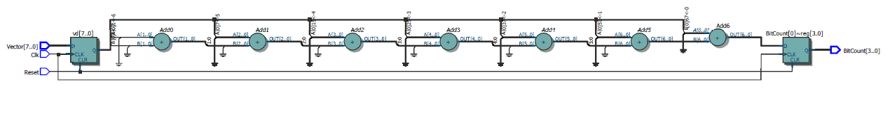
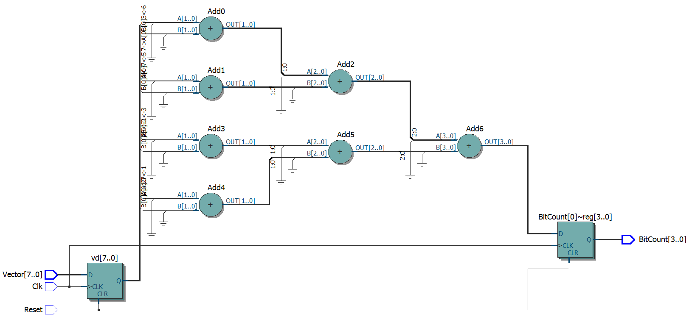

#Recursion in MyHDL#

Today, June 15<sup>th</sup> 2015, I was going through a heap of papers as we recently moved offices 
from Leuven (home of Stella Artois) to Hoegaarden ( home of the famous 'witbier') 
as I stumbled on a printout of this [**Design Advantage**](http://www.comit.com/dav4n3.pdf) from [Comit Systems Inc.](http://www.comit.com)
titled: _Recursive VHDL structures in FPGA synthesis_ by _Rangarajan Sundaravaradan_.  
So I indulged myself in my favourite pastime : Applying recursive programming in hardware.  
Recursion is easy: I learned the rules from a book that I, some 30 years ago, recovered from the garbage bin at a previous employer. 
The book is _LISP, A Gentle Introduction to Symbolic Computation_ by _David S. Touretzky_ (ISBN 0-06-046657-X). 
It has Chapter 8 devoted to Recursion, pages 191 to 213. 
On page 200 the dragon (every decent book on programming has one) enumerates the three rules of recursion:  
   1. Find out how to take just one step
   2. Break each journey down into one step plus a smaller journey
   3. Know when to stop  
   
Let's call this Rule Set A

I rephrased those rules, except the last one:  
   1. Find out how to divide the task into two smaller tasks
   2. Keep on dividing those tasks into smaller tasks
   3. But know when to stop  
   
Let's call this Rule Set B
   
As I said above, recursion is easy; writing a recursive VHDL function to e.g., count the bits in a std_logic_vector is a relatively
 easy task especially if you stick to Rule Set A. 
 
  ``` VHDL
 	function count_bits(s : std_logic_vector) return natural is
	begin
		if (s'length = 1) then
			return to_integer(unsigned(s));
		else
			return to_integer(s(s'low)) + count_bits(s(s'high downto s'low + 1));
		end if;
	end function;
 ```
 
 But the result doesn't differ much from the standard For-Loop approach
 
 ``` VHDL
 	function count_bits(s : std_logic_vector) return natural is
 		variable sum : integer ;
	begin
		sum := 0;
		for i in 0 to(s'high - s'low) loop
			sum := sum + to_integer(s(s'low+i));
		end loop;
		return sum ;		
	end function;
 ```
 
 When synthesised both will end up in a staircase: one might be going up, the other might be going down, but either eventually delivers the sum.
 
 For Loop
 
 
 Recursive Function
 
 
 Now using Rule Set B we get something totally different
 
 ``` VHDL
 	function count_bits(s : std_logic_vector) return natural is
	begin
		if (s'length = 1) then
			return to_integer(unsigned(s));
		else
			return 	  count_bits(s(s'high downto s'low + s'length / 2)) 
					+ count_bits(s(s'low + s'length / 2 - 1 downto s'low));
		end if;
	end function;
 ```
 


We get a bottoms-up binary tree!
You can notice one important advantage of the last approach: we have a lower number of levels of logic; in this case 3 instead of 7.
When the clockfrequency in the FPGA gets high (and when doesn't it?) the last approach will be a lot faster. Imagine you are not adding up the _one_ bits in a vectors but an array of std_logic_vectors.  
Now exactly such a task like adding up the 9 elements in a 3 by 3 [convolution](http://docs.gimp.org/en/plug-in-convmatrix.html), say to do Gauss filtering, calls for a pipelined version.
Recursive functions are inherently non-pipeline-able as you can not infer registers inside a VHDL function (to my knowledge).
And that is why, at the time, I printed that document, and kept it: it talks about using _recursive **components**_. I refer to the [**pdf**](http://www.comit.com/dav4n3.pdf) but it essentially comes down to instantiate the entity itself in its own architecture.
I tried a copy-paste of the code inside the document but that only succeeded partially with quite some editing to do. 
But as I have switched to MyHDL, several months back, I decided to do this in MyHDL instead of doing it in VHDL and consequently abandoned the editing.

Here is the MyHDL code:
```python
import myhdl

import hdlutils

def sumbits(Clk, Reset, D, Q):
    ''' a recursive pipelined implementation'''
    LWIDTH_D = len(D)
	if LWIDTH_D > 2:
        # recurse by splitting things up
        LWIDTH_L = LWIDTH_D - LWIDTH_D / 2
        dupper, dlower = [myhdl.Signal(myhdl.intbv(0)[LWIDTH_L:]) for _ in range(2)]
        lql, lqu = [myhdl.Signal(myhdl.intbv(0)[hdlutils.widthr(LWIDTH_L):]) for _ in range(2)]
        supper = sumbits(Clk, Reset, dupper, lqu)
        slower = sumbits(Clk, Reset, dlower, lql)

		@myhdl.always_comb
       def split():
           ''' this will expand on the left in case the input data-size is uneven '''
           dupper.next = D[: LWIDTH_L]
           dlower.next = D[LWIDTH_L:]

       @myhdl.always_seq(Clk.posedge, Reset)
       def rtlr():
           ''' the result is the sum of the previous branches '''
           Q.next = lqu + lql

       return supper, slower, split, rtlr

    else:
	   # know when to stop
       @myhdl.always_seq(Clk.posedge, Reset)
       def rtl2():
           ''' the result is the sum of the two (terminal) leaves '''
           Q.next = D[1] + D[0]
       return rtl2

``` 

It looks more complicated than the simple VHDL functions we defined earlier, but it matches up to the construct in the paper.

The VHDL (or Verilog, you choose) conversion results in this schematic:


Let's inspect the source:

```python
import myhdl

import hdlutils
```

Obviously we import the MyHDL library. Notice that we refrained from using the wild _from myhdl import *_  
Hdlutils is my library with utility functions. Unfortunately there is no official library, so everybody brings his own.
Here we only see the usage of _widthr()_ but in the code I call on some simulation helper functions too.
_widthr( number )_ returns the number bits to _represent_ the given number( e.g. 7 requires 3 bits and 8 needs 4).

```python
def sumbits( Clk, Reset, D, Q):
    ''' a recursive pipelined implementation'''
    WIDTH_D = len(D)
```

The first thing we do on entrance is find out how many elements we have in our input data.
The strategy in recursion (using Rule Set B) is to cut the task up into smaller tasks and thus the size of the input data evolves with each recursion.

```python
   if WIDTH_D > 2 :
        # recurse by splitting things up
        LWIDTH_L = LWIDTH_D - LWIDTH_D / 2
        dupper, dlower = [myhdl.Signal(myhdl.intbv(0)[LWIDTH_L:]) for _ in range(2)]
        lql, lqu = [myhdl.Signal(myhdl.intbv(0)[hdlutils.widthr(LWIDTH_L):]) for _ in range(2)]
        supper = sumbits(Clk, Reset, dupper, lqu)
        slower = sumbits(Clk, Reset, dlower, lql)

		@myhdl.always_comb
       def split():
           ''' this will expand on the left in case the input data-size is uneven '''
           dupper.next = D[: LWIDTH_L]
           dlower.next = D[LWIDTH_L:]

       @myhdl.always_seq(Clk.posedge, Reset)
       def rtlr():
           ''' the result is the sum of the previous branches '''
           Q.next = lqu + lql

       return supper, slower, split, rtlr

```
This is Rule 1. and 2. of our Rule Set B.  
   1. We simply split each input into two sets. This is achieved by
   
   ```python
        dupper, dlower = [myhdl.Signal(myhdl.intbv(0)[LWIDTH_L:]) for _ in range(2)]

		@myhdl.always_comb
       def split():
           ''' this will expand on the left in case the input data-size is uneven '''
           dupper.next = D[: LWIDTH_L]
           dlower.next = D[LWIDTH_L:]

   ```
   If the actual input set has an uneven number of element we end up with an even and an uneven set. 
   We could pass these on to the next recursion but this will create an imbalance in the number of registers in the path and thus deliver incorrect results.
   So we expand the uneven set with one extra element on the msb side. In the example we are treating here it is a single bit and happens automatically in MyHDL
   when assigning an intbv to a larger one. Now if you are adding up intbv's you have to pad with a _zero value_ intbv (which is a bit more work,
   and which I will show in some not too distant future).
   2. We recurse for each of the two sets
   ```python
        lql, lqu = [myhdl.Signal(myhdl.intbv(0)[hdlutils.widthr(LWIDTH_L):]) for _ in range(2)]
        supper = sumbits(Clk, Reset, dupper, lqu)
        slower = sumbits(Clk, Reset, dlower, lql)

       @myhdl.always_seq(Clk.posedge, Reset)
       def rtlr():
           ''' the result is the sum of the previous branches '''
           Q.next = lqu + lql

       return supper, slower, split, rtlr     
   ```
   We recurse for each newly split-off set and finally add the two returned results in an @always_seq process that will register the result.   

And finally Rule 3.
```python
    else:
	   # know when to stop
       @myhdl.always_seq(Clk.posedge, Reset)
       def rtl2():
           ''' the result is the sum of the two (terminal) leaves '''
           Q.next = D[1] + D[0]
       return rtl2
``` 
When the input data only contains two elements we return the registered sum of them.  

That's all.

Note: I learned today that Christpher Felton has another [fine example](https://bitbucket.org/cfelton/examples/src/f3383e14f18a57852e17c10ee4cd316fbfafbf85/rfft/rfft.py?at=default) 
using recursion in MyHDL. Check it out too!
It is a fully worked-out module so you have to dig into ```def fft_core():``` to find the little gem.

